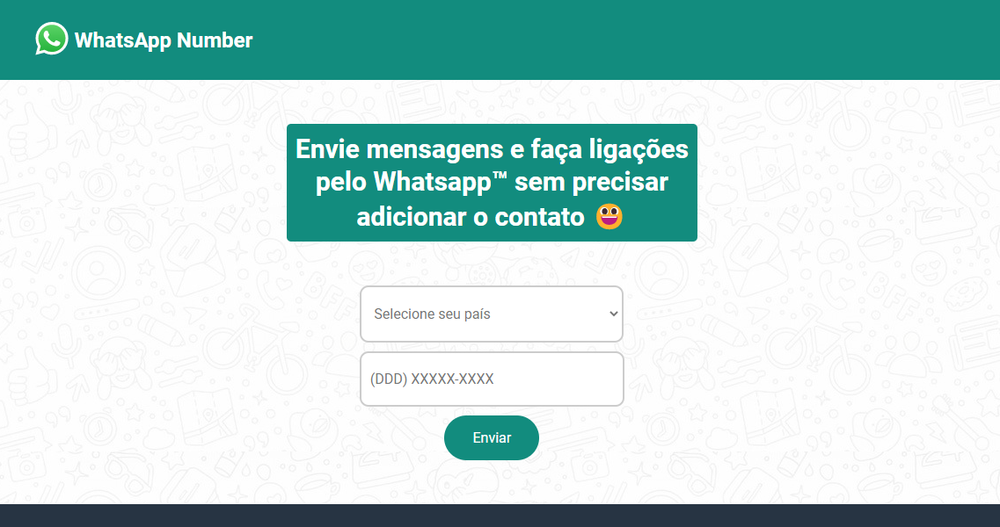

# whatsnumber - Whatsapp Number 📲

<a href="https://whatsappnumber.vercel.app/"></a>

### 🌐 Website

<a href="https://whatsappnumber.vercel.app/">https://whatsappnumber.vercel.app/</a>

### Description

Project to develop a site that connect to Whatsapp's API and enable users to send messages and make calls without adding the contact.

## 🏃🏻 Run Project

1. Clone the Github Repo

   ```ps
   git clone https://github.com/gspetillo/whatsnumber.git
   ```

2. Open the `src/number-form/index.html` file

3. Ready! Use the app, play and contribute!

## 🤝🏻 Contributing

1. Clone the Github Repo

   ```ps
   git clone https://github.com/gspetillo/whatsnumber.git
   ```

2. Code your feature or issue in your favorite IDE (I prefer [Visual Studio Code](https://code.visualstudio.com/)

3. Create a branch from `development` named with your feature.

   - example: my feature is Number Validation, so the branch will be named `number-validation`

4. Commit your changes

   - using semmantic commits and best pratices.
     Read more: https://nitayneeman.com/posts/understanding-semantic-commit-messages-using-git-and-angular/

5. Push your commits to your repo

   ```ps
   git push your_remote_name your_branch_name
   ```

6. Open a Pull Request on the main repo

7. Keep track of comments and review of changes

8. When your issue is merged, request space in the contributors section

## 🧑🏻‍💻 Contributors

### 🪧 Owner

<div style="width: 100px"><a href="https://www.linkedin.com/in/gabrielpetillo/"><p style="text-align: center; font-size: 12px; font-weight: bold">Gabriel Petillo 👑</p></a></div>

### 💯 Contributors

<div style="width: 100px"><a href="https://www.linkedin.com/in/jjean-jacques10/"><p style="text-align: center; 
font-size: 12px; font-weight: bold">Jean Jacques 🎖️</p></a></div>

<div style="width: 100px"><a href="https://www.linkedin.com/in/dabblu-kumar-singh-046189160/"><p style="text-align: center; 
font-size: 12px; font-weight: bold">Dabblu Kumar Singh 🎖️</p></a></div>
